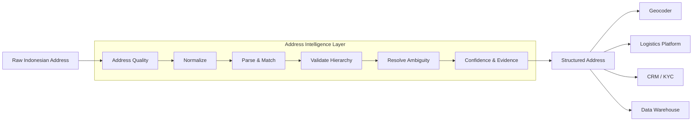
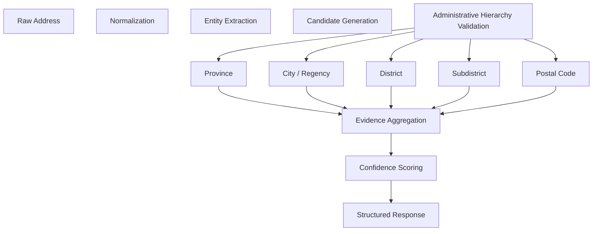

# Address Quality

> **Address Intelligence API for Indonesian addresses.**

Address Quality is an API that helps applications understand, validate, and normalize Indonesian addresses before they are consumed by downstream systems. Rather than treating an address as a plain text string, the API validates administrative hierarchy, resolves ambiguous matches, and returns structured metadata with confidence scores and explainable evidence.

The project is intended for systems where address quality directly affects business operations, including logistics, e-commerce, fintech, insurance, KYC, CRM, and large-scale data cleaning pipelines.

> 🚧 **Active Development**
>
> Address Quality is currently under active development. The validation algorithm, scoring model, and API responses will continue to evolve as additional datasets, edge cases, and validation strategies are incorporated. While the project is already usable, backward compatibility is not guaranteed until the first stable release.

---

# Why Address Quality Exists

Most software systems assume that addresses are already clean, structured, and internally consistent. In practice, this assumption rarely holds true for Indonesian addresses.

End users commonly submit addresses containing abbreviations, aliases, landmarks, RT/RW information, typographical errors, incomplete administrative hierarchy, or informal location descriptions. While these variations are usually understandable to humans, they introduce ambiguity for software systems that rely on deterministic matching.

As a result, applications often forward raw addresses directly into geocoders, logistics providers, KYC platforms, or customer databases. Once poor-quality address data enters these systems, it becomes significantly more expensive to correct, leading to failed deliveries, duplicate customer records, inaccurate administrative mapping, inconsistent analytics, and unnecessary manual verification.

Address Quality is designed to solve this problem before the address reaches downstream systems.

---

# The Challenge of Indonesian Addresses

Indonesian addresses are particularly difficult to process because they combine official administrative regions with informal conventions that vary between cities and communities. A single address may contain road names, RT/RW information, landmarks, local abbreviations, postal codes, or administrative names written with different spellings.

For example, the following address appears simple:

```text
Jl. Merdeka No. 1
Bogor
```

However, the city name alone is ambiguous because it may refer to either **Kota Bogor** or **Kabupaten Bogor**.

Likewise, all of the following examples describe the same administrative locations despite having different textual representations:

```text
Kab Bogor
Kabupaten Bogor

DIY
Daerah Istimewa Yogyakarta

IV Koto
4 Koto

Gg Mawar
Gang Mawar
```

These variations are natural for humans but difficult for software systems that rely on exact string matching.

Administrative changes introduce additional complexity. New regions are created, postal codes evolve, aliases emerge, and multiple administrative areas frequently share the same names. Without understanding the administrative hierarchy itself, software has very little context to determine whether an address is internally consistent.

---

# Where Address Quality Fits

Existing services solve different problems.

Geocoding APIs such as Google Maps or OpenStreetMap are designed to convert addresses into geographic coordinates. Logistics APIs generally assume that an address has already been validated before entering their systems. Neither is primarily responsible for evaluating whether an Indonesian address is complete, internally consistent, or administratively valid.

Address Quality is intended to complement these systems rather than replace them.



Instead of returning only coordinates, Address Quality provides structured information describing how well an address matches Indonesia's administrative hierarchy. Applications can then decide whether to accept the address, warn the user, request corrections, or trigger manual review.

---

# How It Works

Every request follows the same validation pipeline.


Rather than relying on a single string comparison, the validation process evaluates administrative consistency across multiple hierarchy levels. Every matched component contributes evidence that explains the resulting confidence score.

---

# Example

### Input

```text
Jl Merdeka No.56
Citarum
Bandung
40115
```

### Output

```text
Province      ✔ Jawa Barat
City          ✔ Kota Bandung
District      ✔ Bandung Wetan
Subdistrict   ✔ Citarum
Postal Code   ✔ Match

Confidence    97

Evidence

✔ Province matched
✔ City matched
✔ District matched
✔ Subdistrict matched
✔ Postal code matched
```

Instead of producing only a confidence value, Address Quality explains WHY the result reliable. This makes the output suitable for automated decision making as well as debugging and operational review.

---

# Current Features

- Administrative hierarchy validation
- Province, city, district, and subdistrict extraction
- Alias and abbreviation normalization
- Candidate ranking
- Confidence scoring
- Explainable validation evidence
- Postal code verification
- Indonesian-first parsing strategy
- Offline administrative database

---

# Data Sources

Address Quality validates addresses against authoritative administrative reference data instead of relying solely on string similarity.

The primary administrative hierarchy is based on the latest datasets published by Kementrian Dalam Negeri, Keputusan Menteri Dalam Negeri No300.2.2-2430 2025. During development, the project also references several well-maintained community datasets to improve validation quality, verify consistency, and evaluate edge cases.

One of the primary community references is **wilayah_ref** by cahyadsn: https://github.com/cahyadsn/wilayah_ref

The project may incorporate additional authoritative datasets over time as administrative boundaries evolve. Every validation result is designed to remain explainable and traceable back to the supporting administrative entities.

---

# Design Philosophy

Address Quality is designed as an **address intelligence layer**, not a replacement for geocoders or logistics providers.

Its responsibility is to evaluate address quality and provide structured signals that downstream systems can use when making decisions. These signals include normalized administrative components, confidence scores, ambiguity detection, candidate matches, and explainable validation evidence.

Applications remain in control of how these signals are interpreted. Depending on business requirements, an application may automatically accept an address, request user correction, perform manual verification, or continue with downstream geocoding.

---

# Use Cases

Address Quality is suitable for applications that require reliable Indonesian address data, including:

- Logistics and last-mile delivery
- E-commerce checkout validation
- Customer onboarding
- KYC workflows
- CRM data quality improvement
- Marketplace seller verification
- Batch address normalization
- Government and enterprise data migration

---

# Roadmap

- [x] Administrative hierarchy parser
- [x] Candidate generation
- [x] Confidence scoring
- [x] Explainable evidence
- [x] Postal code validation
- [ ] Road-level validation
- [ ] OpenStreetMap integration
- [ ] Google Maps fallback
- [ ] Batch validation API
- [ ] Official SDKs

---

# Documentation

Additional documentation is available in the `docs/` directory.

- Getting Started
- API Reference
- Validation Algorithm
- Confidence Scoring
- Deployment Guide
- Architecture
- Contributing

---

# Contributing

Contributions, discussions, bug reports, and suggestions are welcome. The project is still evolving, and real-world edge cases are invaluable for improving validation accuracy across the diverse addressing conventions found throughout Indonesia.

---

# License

Business Source License 1.1 (BUSL-1.1).

Commercial licensing options will be available separately.