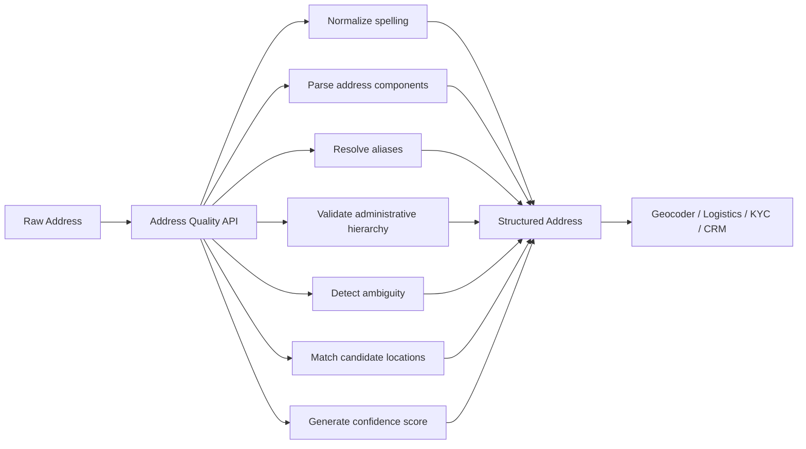

# Address Quality API — Indonesia

## 1. Overview

A lightweight Go HTTP server that accepts free-text Indonesian addresses, normalizes and validates them against Indonesia's administrative hierarchy, and returns structured quality metadata. Designed as an Address Intelligence layer, the API sits between raw user input and downstream systems such as geocoders, logistics platforms, KYC services, and customer databases.

**Status**: v0.1.0 · MVP  
**License**: MIT

---

### 1.1 Problem: Indonesian Addresses Are Difficult for Machines

Most software systems assume addresses are already clean and structured.

In reality, Indonesian users submit addresses as free text containing abbreviations, aliases, landmarks, incomplete administrative information, inconsistent spelling, and ambiguous location names. These inputs are easy for humans to interpret but difficult for software systems to process consistently.

Developers often forward raw addresses directly into downstream systems—including geocoders, logistics APIs, KYC platforms, and CRMs—where poor-quality address data propagates into operational workflows.

Unlike countries with standardized street addressing, Indonesia presents unique challenges:

- 17,000+ islands with diverse addressing conventions.
- Frequent use of landmarks, RT/RW, gang names, and informal descriptions.
- Multiple administrative locations sharing identical names.
- Continuous administrative changes (pemekaran daerah).
- Inconsistent abbreviations and unofficial aliases used by end users.

These characteristics make Indonesian addresses significantly harder to process automatically.

**Common address-quality problems include:**

1. **Typographical errors and unofficial location names**

   Input:

   ```text
   4 Koto, Kabupaten Agam, Sumatera Barat
   ```

   Official administrative name:

   ```text
   IV Koto
   ```

   Humans immediately understand the intended location, while many systems treat these as different places.

2. **Administrative hierarchy inconsistencies**

   Input:

   ```text
   Jl. Siliwangi No.1
   Bogor
   16119
   ```

   The postal code belongs to a different administrative region than the stated city, introducing ambiguity and increasing downstream validation effort.

3. **Incomplete administrative hierarchy**

   Input:

   ```text
   Kapuas Tengah, Kalimantan
   ```

   The province is incomplete ("Kalimantan Tengah"), making the address ambiguous because multiple regions share similar names.

4. **Ambiguous location names**

   Input:

   ```text
   Bogor
   ```

   The address may refer to either:

   - Kota Bogor
   - Kabupaten Bogor

   Without additional context, downstream systems must guess.

5. **Alias and abbreviation variations**

   Examples:

   ```text
   Gg. Mawar
   Gang Mawar

   Kab. Bogor
   Kabupaten Bogor

   DIY
   Daerah Istimewa Yogyakarta
   ```

   These refer to the same location but often appear as different strings.

---

Poor address quality affects every downstream system consuming customer addresses.

Typical consequences include:

- Ambiguous location resolution
- Incorrect administrative mapping
- Duplicate customer records
- Manual customer verification
- Failed or inconsistent geocoding
- Increased operational overhead
- Higher risk of delivery and fulfillment issues

For logistics and e-commerce, address quality is a significant contributor to failed deliveries and customer support costs. For fintech, insurance, marketplaces, and CRM platforms, poor address quality reduces data reliability and increases operational complexity.

---

**Market gap.**

Existing solutions address only part of the problem.

- **Google Maps Geocoding** converts addresses into coordinates but is designed primarily for location lookup rather than administrative validation or address quality assessment.
- **Logistics APIs** (Raja Ongkir, Biteship, courier integrations) generally assume address data has already been cleaned.
- **In-house solutions** require maintaining Indonesian administrative datasets, alias mappings, parsing logic, and continuous updates as administrative boundaries evolve.

Existing APIs primarily focus on geocoding, shipping, or logistics workflows, leaving address quality and administrative consistency as responsibilities for application developers.

---

### 1.2 Solution

Address Quality API acts as an **Address Intelligence layer** between raw user input and downstream systems.

Rather than replacing geocoding or logistics providers, it improves the quality of address data before those systems consume it.



The API is a **classification signal, not a gate**.

Given a free-text Indonesian address, it returns structured metadata describing the quality and consistency of the input. Integrators decide how to use that information—for example:

- Accept the address.
- Accept with warnings.
- Request user correction.
- Trigger manual review.
- Enrich the address before forwarding it to downstream systems.

Typical outputs include:

- Normalized address
- Parsed administrative components
- Administrative consistency status
- Confidence score
- Ambiguity indicators
- Candidate matches

The goal is not to determine whether a package can be delivered, but to help developers detect, understand, and improve address quality before the data enters operational systems.

---

## 2. Quick Start

### 2.1 Local

```bash
git clone <repo-url> address-quality
cd address-quality

cp .env.example .env
# edit .env as needed

make run
# or with hot reload:
# make air
```

```bash
curl -X POST http://localhost:7300/v1/validate \
  -H "Content-Type: application/json" \
  -d '{"address":"Jl. Merdeka No.1, Jakarta Pusat 10110"}'
```

### 2.2 Local Container (Docker Compose)

Multi-stage Dockerfile: Go 1.26 builder → Alpine 3.21 runtime. Non-root user, port 7300, SQLite persisted via volume.

```bash
cp .env.example .env
docker compose up -d --build
```

Config is read from real environment variables (via `viper.AutomaticEnv()`), so the image is environment-agnostic — no `.env` baked in. Local dev mounts `.env` through compose.

---

### 2.3 Production Deployment (VPS + Podman)

**Flow:** GitHub Actions builds on push to `main` → pushes image to `ghcr.io/samaita/address-quality:latest` → VPS pulls and runs via Podman.

#### One-time VPS setup

```bash
# 1. Install podman + podman-compose on the VPS
# 2. Copy deploy files from your machine
scp deploy.sh docker-compose.prod.yml vps:~/address-quality/
scp .env.prod vps:~/address-quality/   # create .env.prod locally first

# 3. Authenticate to GHCR (only needed if the package is private)
ssh vps
podman login ghcr.io
```

`.env.prod` contains production config (API_KEY, rate limits, etc.):

```bash
PORT=7300
API_KEY=<your-secret-key>
RATE_LIMIT=100
RATE_WINDOW=60
MAX_BODY_SIZE=1M
MAX_ADDRESS_LENGTH=1000
```

#### Deploy / Update

```bash
ssh vps
cd ~/address-quality
./deploy.sh
```

`deploy.sh` pulls the latest image, recreates the container, runs a health check on `/health`, and prunes dangling images. SQLite data persists in the `address-data` volume across deploys.

#### Rollback

Every CI build is also tagged `sha-<short>`. To roll back:

```bash
# List available tags
podman images ghcr.io/samaita/address-quality

# Edit docker-compose.prod.yml: image: ghcr.io/samaita/address-quality:sha-<short>
# Then:
./deploy.sh
```

| Dependency | Purpose |
|---|---|
| `golang:1.26-alpine` | Build stage |
| `alpine:3.21` | Runtime (~5 MB) + wget for healthcheck |
| `.env.prod` | Production config (gitignored, never committed) |

---

### 2.4 Reverse Proxy (Nginx)

When running behind an nginx reverse proxy under a path prefix, use the example config at `deploy/nginx.example.conf`. Place it inside your server's `http` block.

This maps the external path `/address-quality/v1/validate` to the upstream application's `/v1/validate` endpoint on port 7300:

```nginx
location /address-quality/ {
    proxy_pass http://127.0.0.1:7300/;
    # The trailing / strips the /address-quality prefix,
    # so /address-quality/v1/validate -> /v1/validate
}
```

The `$connection_upgrade` variable (used in proxy headers) is defined by a `map` directive in the `http` block. See the example file for the complete setup.

---

## 3. Tech Stack

| Component       | Technology                          | Version |
|----------------|--------------------------------------|---------|
| Language       | Go                                   | 1.26.5  |
| Web Framework  | Echo                                 | v4      |
| Config         | Viper (reads .env)                   | latest  |
| Sanitization   | Bluemonday (UGCPolicy)               | latest  |
| Database       | SQLite (via modernc.org/sqlite)      | latest  |
| Rate Limiting  | samaita/go-http-ratelimit            | latest  |
| Hot Reload     | Air (air-verse/air)                  | latest  |
| UUID           | google/uuid (UUIDv7)                 | latest  |

---

## 4. Configuration

All configuration is via `.env` file (not committed — see `.env.example`). Restart required after changes.

| Key           | Default | Description                      |
|---------------|---------|----------------------------------|
| `PORT`        | `7300`  | HTTP listen port                 |
| `API_KEY`     | `""`    | Reserved for future auth         |
| `RATE_LIMIT`  | `100`   | Max requests per window          |
| `RATE_WINDOW` | `60`    | Rate limit window in seconds     |

---

## 5. API Reference

### `POST /v1/validate`

#### Request

```json
{
  "address": "Jl. Merdeka No.1, Jakarta Pusat 10110"
}
```

| Field     | Type   | Required | Description                  |
|-----------|--------|----------|------------------------------|
| `address` | string | yes      | Free-text Indonesian address input |

#### Response (200 OK)

```json
{
  "timestamp": "2026-07-08T12:00:00Z",
  "request_id": "01952e8e-1b40-7f47-8000-000000000001",
  "quality": {
    "address_id": "01952e8e-1b40-7f47-8000-000000000002",
    "confidence": 0.0,
    "location": {
      "postal_code": "",
      "sub_district": "",
      "district": "",
      "city": "",
      "province": ""
    },
    "normalized_input": "Jl. Merdeka No.1, Jakarta Pusat 10110",
    "output": "Jl. Merdeka No.1, Jakarta Pusat 10110",
    "location_version": "",
    "raw_input": "Jl. Merdeka No.1, Jakarta Pusat 10110"
  }
}
```

#### Error Responses

| Status | Body                                                              | Description             |
|--------|-------------------------------------------------------------------|-------------------------|
| 400    | `{"timestamp":"...","request_id":"...","error":"address is required"}` | Missing address field   |
| 429    | `{"error":"rate limit exceeded","retry_after":60}`                | Too many requests       |
| 500    | `{"timestamp":"...","request_id":"...","error":"failed to store record"}` | Database error      |

#### Rate Limit Headers

```
X-RateLimit-Limit: 100
X-RateLimit-Remaining: 42
X-RateLimit-Reset: 1718000000
```

---

## 6. Data Flow

```
Client → POST /v1/validate
          │
          ▼
    Echo Router
          │
          ▼
    Rate Limiter (samaita/go-http-ratelimit)
          │
          ▼
    Handler
      ├─ Validate address non-empty
      ├─ Parse JSON → model.AddressRequest
      ├─ Generate UUIDv7 (request_id) + UUIDv7 (address_id) + timestamp
      ├─ Sanitize with bluemonday UGCPolicy
      ├─ Build quality object
      │   ├─ address_id = generated address UUID
      │   ├─ normalized_input = sanitized text
      │   ├─ output = sanitized text (placeholder)
      │   ├─ location = empty (placeholder)
      │   └─ confidence = 0.0
      ├─ Persist to SQLite (address_requests table)
      └─ Return model.AddressResponse (JSON)
```

---

## 7. Database

### Schema

```sql
CREATE TABLE IF NOT EXISTS address_requests (
    id                 TEXT PRIMARY KEY,
    address_id         TEXT NOT NULL,
    raw_input          TEXT NOT NULL,
    normalized_address TEXT DEFAULT '',
    confidence         REAL DEFAULT 0,
    postal_code        TEXT DEFAULT '',
    sub_district       TEXT DEFAULT '',
    district           TEXT DEFAULT '',
    city               TEXT DEFAULT '',
    province           TEXT DEFAULT '',
    location_version   TEXT DEFAULT '',
    output_json        TEXT DEFAULT '',
    created_at         TEXT NOT NULL
);
```

### Notes

- SQLite file: `address.db` (git-ignored)
- `id` = request UUID, `address_id` = address entity UUID (separate from request ID)
- Single-writer mode (`MaxOpenConns = 1`) for SQLite safety
- Auto-migrated on startup via `CREATE TABLE IF NOT EXISTS`
- All location fields are empty in MVP — reserved for geocoding integration
- `created_at` stored as ISO8601 UTC string

### Location Database

The `location.db` SQLite database powers the administrative tree parser (v1). It stores Indonesian administrative region codes (province → city → district → subdistrict), their names, normalized forms, and postal codes — sourced from Kepmendagri No 300.2.2-2138 Tahun 2025.

**Schema** is defined in `db/location.sql`:
- `location_levels` — hierarchy level lookup (province/city/district/subdistrict)
- `location_sources` — upstream data source registry
- `location_codes` — core table with 90k+ administrative region records
- `location_hierarchy` — precomputed tree relation (subdistrict → district → city → province)
- `location_alias` — alternative names/abbreviations for locations

#### Seeding

The `seeder` binary parses MySQL dumps (`db/source/wilayah.sql`, `db/source/wilayah_kodepos.sql`) and populates `location.db`:

```bash
# First-time: create schema + seed data
make seed

# Or directly:
go run ./cmd/seeder --init

# Recreate from scratch (destructive — prompts for confirmation):
go run ./cmd/seeder --drop

# Retry without recreating schema (truncate data only):
go run ./cmd/seeder --truncate

# Update data (tables must already exist):
go run ./cmd/seeder

# Show all options:
go run ./cmd/seeder --help
```

| Flag | Default | Description |
|------|---------|-------------|
| `--source-code` | `kemendagri` | Source code identifier |
| `--source-version` | `2025` | Dataset version tag |
| `--source-name` | `Kepmendagri No 300.2.2-2138` | Human-readable source name |
| `--source-date` | `""` | Effective date of the codes |
| `--source-desc` | `""` | Description of the source dataset |
| `--init` | `false` | Create schema from `db/location.sql` (only when no tables exist) |
| `--drop` | `false` | Drop all tables and recreate (prompts for confirmation) |
| `--truncate` | `false` | Truncate data rows (keep schema) before seeding |
| `--db` | from `.env` | Path to `location.db` |

`--init`, `--drop`, and `--truncate` are mutually exclusive.

---

## 8. Geocoding Strategy (v1 → v3 Evolution)

The algorithm evolves across major versions to balance accuracy, cost, and coverage for Indonesian addresses.

### v1: Administrative Tree Parser
Parse the free-text input and discard all non-administrative tokens (landmarks, gang, RT/RW, building names). Extract only the administrative hierarchy (province → city/kabupaten → kecamatan → kelurahan → postal code) and validate it against a known reference tree. Fast, zero-cost, works fully offline — but cannot resolve ambiguous or novel locations.

### v2: OpenStreetMap Geocoding
Supply the full address string to a self-hosted or API-based OSM Nominatim instance. OSM's Indonesia coverage is strong for major roads and administrative boundaries. No API key required — only infrastructure cost. Coverage gaps exist in rural/peri-urban areas and newly pemekaran regions.

### v3: Google Maps Geocoding Fallback
If OSM returns low confidence or no result, fall back to the Google Maps Geocoding API for the same query. Higher cost (~USD 0.005 / call) but better coverage for informal addresses, landmarks, and newly created subdivisions. Reserved for the subset of queries that OSM cannot resolve.

### Summary

| Version | Method              | Cost     | Coverage | Offline |
|---------|---------------------|----------|----------|---------|
| v1      | Admin tree parser   | Free     | Moderate | ✅      |
| v2      | OSM Nominatim       | Free*    | Good     | ❌      |
| v3      | Google Maps fallback| Paid     | Best     | ❌      |

\* Self-hosted infrastructure cost only

---

## 9. Rate Limiting

- **Library**: `github.com/samaita/go-http-ratelimit`
- **Strategy**: Token bucket (in-memory, per IP per endpoint via `Rules` pattern matching on `* /v1/*`)
- **Default**: 100 requests per 60-second window per IP per `/v1/*` endpoint
- **Configurable** via `RATE_LIMIT` and `RATE_WINDOW` in `.env`
- **Scope**: Only `/v1/*` is rate-limited; `/health` is exempt
- **Headers**: `X-RateLimit-Limit`, `X-RateLimit-Remaining`, `X-RateLimit-Reset`, `Retry-After`
- **Error**: HTTP 429 with JSON body (includes dynamic `retry_after` matching configured window)

Future: Redis-backed distributed rate limiting for multi-instance deployments.

---

## 10. Architecture Decisions

| Decision | Rationale |
|----------|-----------|
| Viper for config | Standard Go config library, supports .env, env vars, defaults |
| Global config var | Simple startup-time binding; restart to reload (no hot-reload needed) |
| Pure Go SQLite (modernc) | Zero CGO dependency, easy cross-compilation |
| Rate limiter as Echo middleware | Clean separation, reusable, swappable |
| bluemonday UGCPolicy | Safe default: allows basic formatting, strips XSS |
| UUIDv7 | Time-ordered UUIDs, good for DB indexing |
| Air for dev | File watching + auto-restart, minimal config |

---

## 11. Future Features (Open for Contribution)

- [ ] **API authentication** (API key via `API_KEY` env var, header validation)
- [x] **Health check endpoint** (`GET /health`)
- [ ] **Graceful shutdown** (signal handling)
- [x] **Dockerfile + docker-compose**
- [ ] **CI/CD** (GitHub Actions: lint, test, build)
- [ ] **Testing suite** (unit + integration tests)
- [ ] **Structured logging** (zerolog or zap)
- [ ] **Geocoding validation** (Indonesian postal code format, known city/district/sub-district lookup, reverse geocoding)
